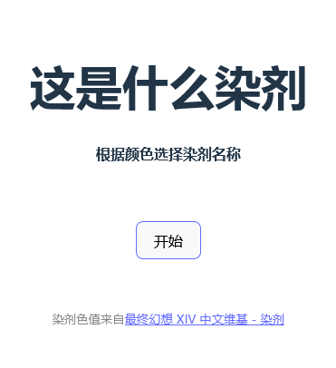
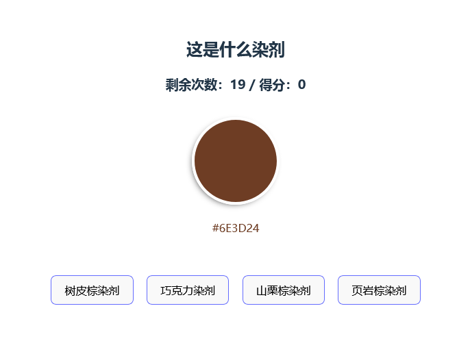
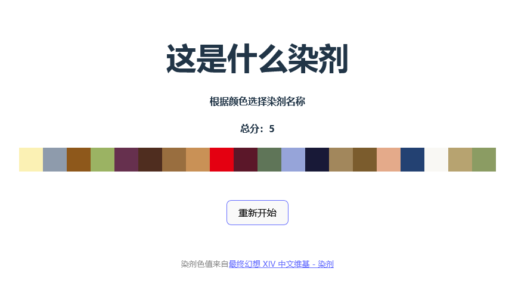
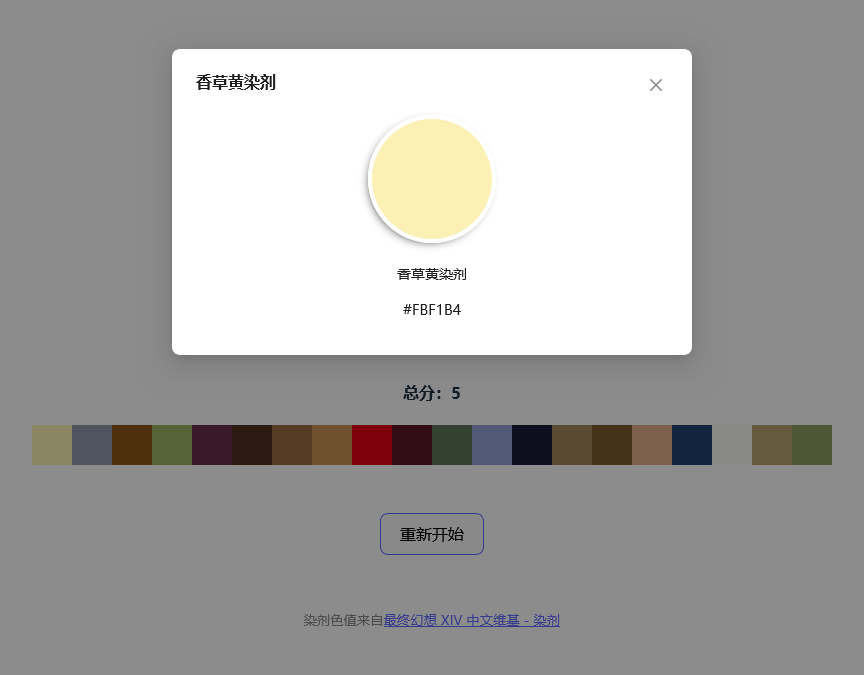

# 这是什么染剂

一个根据颜色猜染剂名称的小游戏，染剂是最终幻想 XIV 中的染色道具

地址：https://nel-desu.github.io/ffxiv-dye/

> 其中染剂名称及色值数据来自[最终幻想 XIV 中文维基 - 染剂](https://ff14.huijiwiki.com/wiki/染剂)

> 项目是 React + TypeScript + Vite，还使用了 antd 的组件

## 截图

### 开始

### 选项

### 结束

### 查看颜色

